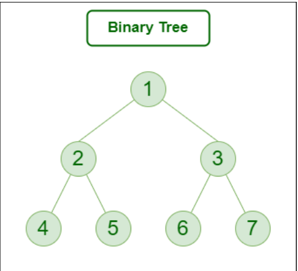
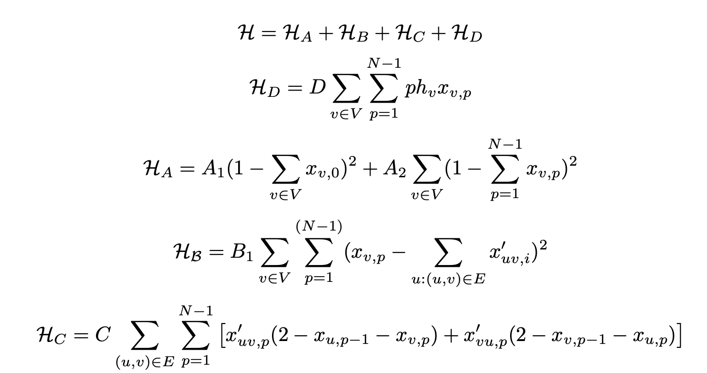
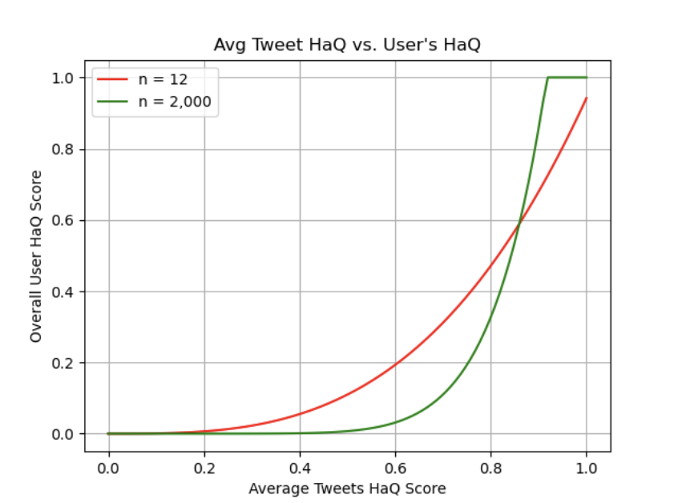
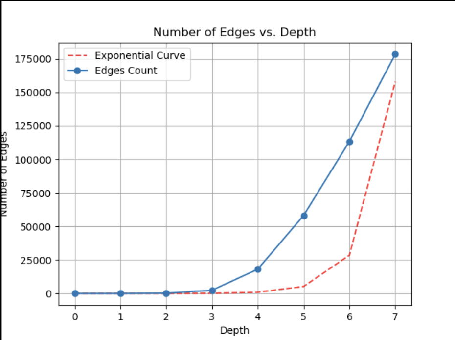

<!-- 

 -->

# Al-HaQ | الحق | (The Truth)

_Leveraging the power of quantum computing to create trustworthy and effective tools for battling the spread of fake news on social media._

<!---->

Check out the latest updates on our [**GitHub Repository**](https://github.com/Haq-Lense/Al-HaQ).

### NYUAD Hackathon for Social Good in the Arab World: Focusing on Quantum Computing (QC) and UN Sustainable Development Goals (SDGs).

[https://sites.nyuad.nyu.edu/hackathon/](https://sites.nyuad.nyu.edu/hackathon/)

## Presentation

_The slides can be viewed [here](https://www.canva.com/design/DAGDmjJBkM8/WADayAoPQzvoAcPfsHyGAQ/view)._

## Motivation

Fake news can spread up to 10 times faster than true reporting on social media. These often reach 100,000+ people within a few hours, and the implications can be devastating in spreading misinformation, even when corrected. AlHaq is a cross-platform service that tailors any user’s social media feed to amplify trusted information within their social network using quantum computing. AlHaq can detect fake news from a social media user, rank the trustedness of members in their social network, and adapt their social media feed to boost true news sources and filter disinformation.

**Quantum algorithm**:

- Quantum Optimization for QUBO problems
- Quantum Machine Learning Algorithm

***Formulation of the problem as a QUBO***:
- We are going to model the social media feed problem as a graph. Consider s the root user, who consults his feed. The closest users in the app will be those that he/she follows (depth 1). The next closest users will be those followed by the ones he/she follows (depth 2). We can model this as a binary tree:

- With the Haq system we are able to compute a trustedness score for each user (I elaborate on that later). This allows us to assign a weight to each user, turning the binary tree into a weighted binary tree/graph. Now we consider that at every step we take from a node, each edge will carry a weight p, for step p. So the first step from the root node has weight 1, the second step has weight 2... etc. 
- Now we would like to make a path that passes through each node only once, which represents the optimal order in which the feed will be displayed. This will obviously depend on the Haq score of the users, prioritising that the higher Haq and closer users come up first.

***Problem***:
- Find the path that starts at the user, and that crosses every node (only once), in a way such that it minimizes the sum of weight x step number.
Mathematically, considering that the network is a graph G = (E, V ), and that the total number of edges is N

- Where p is the step number (from the root node), hv is the Haq score of the user corresponding to node v, and xv,p is a binary variable which is 1 if node v is in position p in the path from xs,0.

- Then Team modified the QUBO Hamiltonian for our use case:

But we did limit the equation to a few terms to actually work out in the Timeframe of the NYUAD Hackathon.

**Installation Instructions:**
**_Requirements:_**
pip3 install -r requirements.txt

\*Conda users, please make sure to `conda install pip` and use it for the above requirements.

**Input to the program:**

- Feed information from the extension

### Using Quantum Optimization for QUBO problems

 computing can be ingeniously leveraged to balance between the truthfulness of content and user preferences in social media feeds by modeling the selection process as a Quantum Unbounded Binary Optimization (QUBO) problem. The QUBO framework is well-suited for optimizing binary decision variables under certain constraints and objectives, making it ideal for handling complex, multifaceted decisions like curating personalized news feeds. In this scenario, each piece of content can be represented as a variable whose state (selected or not selected for display) depends on both its veracity and its alignment with user preferences. The objective function in the QUBO model can be designed to maximize the truthfulness of the content while also considering user engagement metrics, such as past interaction history and expressed interests.

Implementing this with quantum computing involves constructing a quantum system where each potential news item's relevance and truthfulness are encoded into quantum bits (qubits). The interactions between these qubits—reflecting the intricate balance of providing truth while catering to user tastes—are then meticulously optimized using quantum algorithms. This approach exploits the quantum parallelism that allows the examination of multiple potential combinations of news items simultaneously, rapidly converging on an optimal mix that upholds informational integrity and user satisfaction. As quantum processors mature, this method could substantially enhance the capability of social platforms to deliver highly personalized yet accurate and reliable content, thus fostering a more informed and engaged user base while combating misinformation effectively.

### Using Quantum Machine Learning

Quantum Machine Learning (QML) offers a promising avenue for detecting fake news due to its potential to handle complex, high-dimensional datasets more efficiently than traditional machine learning techniques. In the realm of social media, where data proliferates rapidly and is rich in variety (including text, images, and metadata), QML can exploit the principles of quantum mechanics to process information in fundamentally novel ways. For example, quantum superposition allows QML models to examine multiple possibilities simultaneously, and quantum entanglement can be used to uncover deep correlations within data that are not discernible with classical algorithms. These capabilities make QML ideally suited for detecting subtle anomalies or patterns associated with misinformation, which often require the analysis of nuanced textual and contextual relationships that classical methods might overlook.

Furthermore, the application of QML in fake news detection is compelling because of its potential scalability and speed, which are critical in the fast-paced environment of social media. As quantum processors continue to evolve, they are expected to perform certain computations exponentially faster than their classical counterparts, allowing for real-time analysis and response to emerging fake news stories. Additionally, quantum-enhanced natural language processing techniques can improve the accuracy of semantic analysis, sentiment detection, and the contextual interpretation of posts, which are crucial for assessing the veracity of information. By integrating QML into existing digital platforms, it's possible to create a robust, automated system that not only flags potential fake news for human review but also learns from ongoing inputs to improve its predictive accuracy over time, thereby reinforcing the integrity of information shared online.

*Result*

- Graphs to show Haq Score vs Tweets

- Graphs of Edges to depth of the users:

## Acknowledgements

**Hackers:**
[Ahmad](https://github.com/ahmad-sm02), [Emanuel](https://github.com/juniorGitH), [Ghada](https://github.com/ghadaalhajeri), [Mariam](https://github.com/mariam606), [Omar](https://github.com/Ellzo), [Pablo](https://github.com/qrodenas), [Salma](https://github.com/salmaAlsaghir), [Savar](https://github.com/SavarJ)

**Mentors:**
[Akash](https://github.com/akashkthkr), [Favour](https://github.com/favour-nerrise)

And thank you to the oragnising committee of [NYUAD 2024 Hackathon](https://sites.nyuad.nyu.edu/hackathon/) and Qbraid and other student who made it possible and great.
